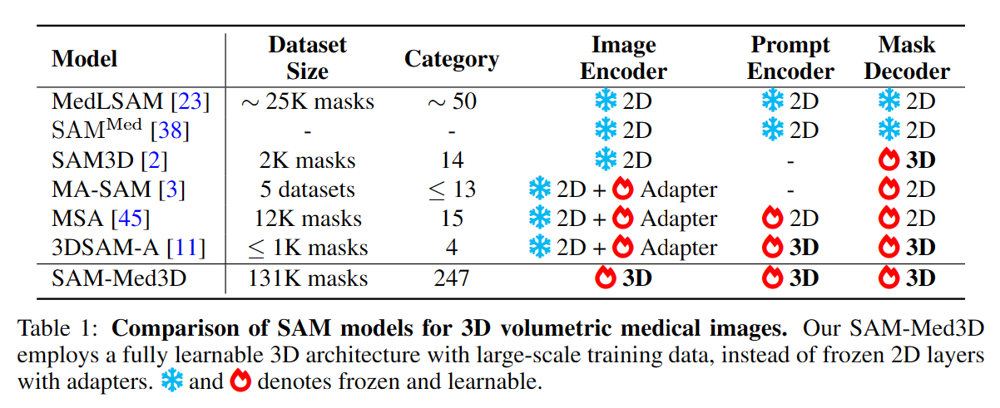
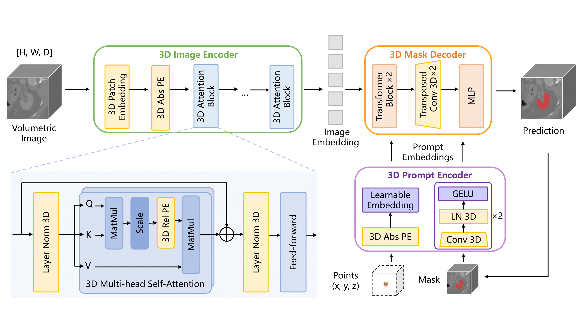

# SAM-Med3D \[[Paper](https://arxiv.org/abs/2310.15161)]

3D version of SAM for CTs, based off: [SAM-Med3D](https://github.com/uni-medical/SAM-Med3D)

## 🔨 Usage
### Training / Fine-tuning
(we recommend fine-tuning with SAM-Med3D pre-trained weights from [link](https://github.com/uni-medical/SAM-Med3D#-checkpoint))

To train the SAM-Med3D model on your own data, follow these steps:

#### 0. **(Recommend) Prepare the Pre-trained Weights**

Download the checkpoint from [ckpt section](https://github.com/uni-medical/SAM-Med3D#-checkpoint) and move the pth file into `SAM_Med3D/ckpt/sam_med3d.pth` or `SAM_Med3D/ckpt/sam_med3d_turbo.pth`.


#### 1. Prepare Your Training Data (from nnU-Net-style dataset): 

Ensure that your training data is organized according to the structure shown in the `data/validation` directories. The target file structures should be like the following:
```
sam_med3d_cache
      ├── lidc
      │ ├── imagesTr
      │ │ ├── 1.3.4.1236123713.nii.gz
      │ │ ├── ...
      │ ├── labelsTr
      │ │ ├── 1.3.4.1236123713.nii.gz
      │ │ ├── ...
      ├── 
```

#### 2. **Run the Training Script**: 
```
python train.py --task_name ${tag}
```
This will start the training process of the SAM-Med3D model on your prepared data. (Note: this implementation doesn't support the multi-gpu training yet)

The key options are listed below:

- task_name: task name
- checkpoint: pre-trained checkpoint
- work_dir: results folder for log and ckpt
- multi_gpu: use multiple GPU with DDP
- gpu_ids: set gpu ids used for training
- num_epochs: number of epoches
- batch_size: batch size for training
- lr: learning rate for training


**Hint**: Use the `--checkpoint` to set the pre-trained weight path, the model will be trained from scratch if no ckpt in the path is found!

### Evaluation
Run the following python command to test SAM-Med3D on your data. 
Make sure the masks are processed into the one-hot format (have only two values: the main image (foreground) and the background).

```
python test.py --seed 2023\
 -vp ./results/visualization/lidc_test \
 -cp ./work_dir/lidc_finetune/sam_model_dice_best.pth \
 -tdp /cache/fast_data_nas8/utkarsh/sam_med3d_cache -nc 10
```

- vp: visualization path, dir to save the final visualization files
- cp: checkpoint path
- tdp: test data path, where your data is placed
- nc: number of clicks of prompt points

<!-- For validation of SAM and SAM-Med2D on 3D volumetric data, you can refer to `infer_sam.sh` and `infer_med2d.sh` for details. -->
For validation of MedSAM 3D volumetric data, you can refer to `medsam_infer.sh`


## 🗼 Method
<div align="center">
  
</div>
<div align="center">
  
</div>

## To-Do

Code:
- write Predictor class for 3D and use it for inference
- write AutomaticMaskGenerator class for 3D and generate all nodule masks at once in inference
